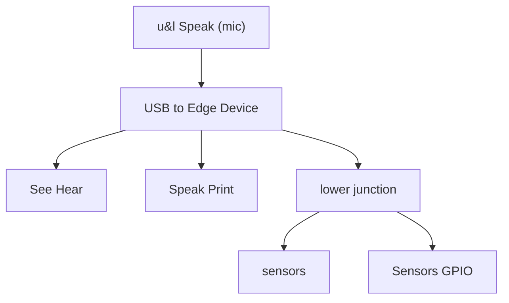
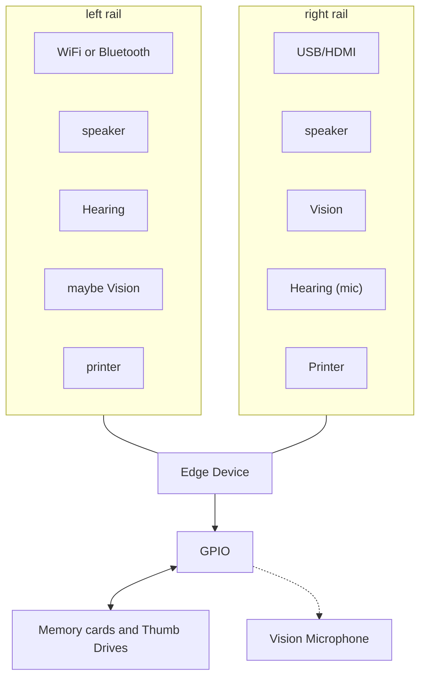

# EDGE DEVICE I/O FLOW — as-drawn + clarifications
Generated: 2026-10-05 18:22:20 EDT
Fail-closed. No publish. No install on Pi/phone/laptop. No sealed bodies invented.
Sketch (source copy): `EDGE_DEVICE_IO_SKETCH_2026-10-05.jpg`
Project: `/workspace/session-scan-2026-10-05/generated-code/tims-edge-math`
Scope note: this is the **device I/O shell** only. Descending-power sampler / live-stream RGB is a **separate** concept — do **not** claim video hardware is running.

---

## Sketch link

- On-disk: `/workspace/session-scan-2026-10-05/generated-code/tims-edge-math/reference-map/EDGE_DEVICE_IO_SKETCH_2026-10-05.jpg`
- Paper note: CareSource letterhead visible on left margin (not part of the design).

---

## Diagram A — USB to Edge Device hub (top half of sketch)

As drawn (horizontal divider separates A above from B below):

| Direction | Label on sketch | Role (reading only) |
|-----------|-----------------|---------------------|
| Top → center | `u&l Speak (mic)` + small mouth/mic mark | Speech / mic **in** to hub |
| Center | `USB to Edge Device` | Hub box |
| Left ← | `See Hear` | See / Hear path (left) |
| Right → | `Speak Print` | Speak / Print path (right) |
| Down → small square | (unlabeled junction) | Lower branch |
| Junction left | `sensors` | Sensors (generic) |
| Junction right | `Sensors GPIO` | Sensors via GPIO |

Transcription of flow:

1. Mic / “u&l Speak” enters the **USB to Edge Device** hub from above.
2. Hub fans left to **See Hear**.
3. Hub fans right to **Speak Print**.
4. Hub drops to a lower junction, then splits to **sensors** (left) and **Sensors GPIO** (right).

---

## Diagram B — Edge Device + GPIO stack (bottom half of sketch)

Central stack (two boxes, Edge Device above GPIO):

| Side | Labels top → bottom (as drawn) |
|------|--------------------------------|
| Left of Edge Device | `WiFi or Bluetooth` · `speaker` · `Hearing` · `maybe Vision` · `printer` |
| Right of Edge Device | `USB/HDMI` · `speaker` · `Vision` · `Hearing (mic)` · `Printer` |
| Below GPIO (double arrow) | Side note: `Vision Microphone` · Base label: `Memory cards and Thumb Drives` |

Transcription of flow:

1. **Edge Device** sits above **GPIO** as a stacked pair.
2. Left rail: wireless (`WiFi or Bluetooth`), speaker, Hearing, maybe Vision, printer.
3. Right rail: wired (`USB/HDMI`), speaker, Vision, Hearing (mic), Printer.
4. GPIO connects downward (double-headed arrow) toward **Memory cards and Thumb Drives**, with **Vision Microphone** noted beside that link.

---

## Timothy’s clarifications (voice / chat — not inventing beyond these)

1. **Two similar conceptual diagrams** for flows **all** edge devices should be able to do.
2. **GPIO is optional** — not required on every device (explicit example: laptop).
3. **Appropriate language for the appropriate device** (BASIC / Python / C++ / ROS2 / etc. chosen per target — mapping UNDEF until ported).
4. Outputs: **speech**, **print**, and **auditory** output including **braille**.
5. Scope of this shell: a **basic device** with **preinstalled** software/firmware to **instantly operate** what it already has, **or** `pip install` (or equivalent) **new software on detection of need**.
6. **Record distribution**: online periodically **and/or** on-device.
7. **Adapt targets**: drones, hives, swarms, ROS2, or a plain smartphone (also laptop without GPIO).

---

## GPIO-optional rule

- Diagram A shows **Sensors GPIO** as one lower branch — not the only sensors path (`sensors` also appears without GPIO).
- Diagram B stacks GPIO under Edge Device — useful when present (Pi-class boards, robot frames).
- **Laptop / many phones**: Edge Device I/O still applies; **GPIO block may be absent**. Fail-closed: do not require GPIO APIs on non-GPIO targets.

---

## Language per device (intent only — no install this turn)

| Target | Likely surface (standing project hints only) | Status |
|--------|-----------------------------------------------|--------|
| BASIC boot / bwbasic | `/workspace/hybrid-boot/BOOT.bas` standing boot | Present on box; not an I/O driver |
| Pythonista (iPhone) | `targets/pythonista/` stubs in tims-edge-math | Port map UNDEF |
| Pi 5 | `targets/pi5/` notes | Port map UNDEF; GPIO optional when used |
| Laptop | No GPIO required | Port map UNDEF |
| ROS2 / drone / hive / swarm | Named adapt targets | Port map UNDEF |
| Smartphone (generic) | Same I/O shell, no GPIO assumed | Port map UNDEF |

No software was installed on Timothy’s Pi, phone, or laptop this turn.

---

## Outputs: speech / print / auditory / braille

From sketch + clarifications:

| Channel | On sketch? | Clarification |
|---------|------------|---------------|
| Speak / speaker | Yes (A right; B left+right) | Speech / auditory out |
| Print / printer | Yes (A right; B left+right) | Print out |
| Hearing / mic in | Yes (A top; B Hearing / Hearing (mic)) | Auditory in |
| See / Vision | Yes (A left See; B Vision / maybe Vision) | Vision in (conceptual) |
| Braille | **Not drawn on sketch** | Clarified verbally as auditory/tactile output family — treat as required output class for accessible devices; **implementation UNDEF** |
| Sensors / GPIO sensors | Yes (A lower) | When hardware present |
| WiFi / Bluetooth | Yes (B left) | Comms |
| USB / HDMI | Yes (B right; A hub is USB-centric) | Wired I/O |
| Memory cards / thumb drives | Yes (B bottom) | Local storage / distribution medium |

---

## Preinstall + on-need install

- **Preinstalled** firmware/software: device should **instantly operate** what it already carries.
- **On detection of need**: `pip install` or **equivalent** for that platform (apt, ROS package, App Store sideload, etc.) — **exact package list and detectors UNDEF**.
- Fail-closed this turn: nothing installed on real devices; no Cursor cloud; no Bank of America; no calls.

---

## Record distribution modes

| Mode | Stated? | Detail on sketch? |
|------|---------|-------------------|
| Online, periodically | Clarified | Mechanism / schedule / endpoint **UNDEF**. May ride WiFi or Cellular (F') |
| On device | Clarified | Aligns with Memory cards / Thumb Drives on Diagram B; format **UNDEF** |

---

## Adapt targets

Named: **drones**, **hives**, **swarms**, **ROS2**, **plain smartphone**, plus **laptop** (GPIO-optional).  
Wiring of this I/O shell into any of those stacks: **UNDEF** (concept only).

---

## Mermaid — Diagram A (USB hub)

## Mermaid — Diagram B (Edge Device + GPIO stack)

---

## Explicit UNDEF (not on sketch / not specified — do not invent)

1. Exact USB device classes, HID mappings, or cable pinouts.
2. Which mic is “u&l Speak” (USB vs onboard vs Bluetooth) beyond the label.
3. Whether “See Hear” is one combined path or two parallel channels.
4. Braille hardware model / API (clarified as needed; not drawn).
5. GPIO pin map, voltage, or sensor list.
6. Vision camera model; “maybe Vision” criteria.
7. HDMI role (display only vs capture) beyond the label `USB/HDMI`.
8. WiFi vs Bluetooth preference / pairing flow.
9. On-need install detector logic and package names per OS.
10. Online record-distribution protocol, host, and period.
11. On-device record format and path layout.
12. ROS2 node graph / drone / hive / swarm wiring.
13. Language binding matrix (beyond “appropriate language for appropriate device”).
14. Any claim that live video / descending-power RGB sampler hardware is running (separate concept).
15. Sealed kbld / MinRadius / GOSUB primitive bodies — **not** part of this I/O shell doc.

---

## Locked answers A–F (cross-link, 2026-10-05 ~6:36 PM ET)

Timothy's handwritten answers are locked in `EDGE_LOCKED_ANSWERS_2026-10-05.md` (card: `EDGE_UNKNOWNS_ANSWERS_A-F_2026-10-05.jpg`) and applied to `EDGE_DEVICE_PORT_MAP_2026-10-05.md`. In sketch terms:
- **F** (code sent by BT, WiFi, or USB) = Diagram B left rail `WiFi or Bluetooth` + right rail `USB/HDMI` + Diagram A `USB to Edge Device` hub — all three are code-delivery paths.
- **E** (combo webcam+speaker optional; owned JBL Clip 4 BT speaker + 2 cameras with mics) = B `speaker` / `Vision` / `Hearing (mic)` and the `Vision Microphone` note can be met by separate owned units. Not connected or paired.
- **A** smartphone: both, iOS first · **B** laptop: ASUS TUF Gaming A15, 64 GB, Windows 11 (or 10 & 11), no GPIO · **C** Hive = ≥5 drones + optional Queen (or Maiden) · **D** software adaptable for all.
- **F'** (2026-10-05 ~6:50 PM ET): **Cellular** added as a fourth code/record path (T). Not on the sketch; it sits beside the `WiFi or Bluetooth` rail as another network link. Pi-fit modem ("Q-tel" as-heard lead, SKU UNDEF) or smartphone tether. See `EDGE_CELLULAR_NOTE_2026-10-05.md`.
- **G / DM-1…DM-7** (2026-10-05 ~6:55 PM ET): sketch `Record distribution` / Diagram B `Memory cards and Thumb Drives` = local-first. Devices add to / take from files on demand or need **without the cloud**; cloud and masked APIs only from time to time; home network exists. See `EDGE_DATA_MOVEMENT_POLICY_2026-10-05.md`. Owned hardware as seen (Pi Zero 2 W, GY-521, BMM150, QMC5883P, USB stick): `EDGE_HW_INVENTORY_2026-10-05.md`.
UNDEF list above is unchanged except where the port map records it cleared.

---

## Standing separation

- **This file**: edge-device I/O concept shell (ports, senses, install/distribution intent).
- **Not this file**: descending power sampler / live-stream RGB / sealed math primitives.
- Continuity still boots from BASIC `BOOT.bas` PRINT `0.70710678` on Grok surfaces; that boot is math continuity, not a claim that these I/O ports are live.

---

## Footer — hashes

| File | sha256 |
|------|--------|
| `EDGE_DEVICE_IO_SKETCH_2026-10-05.jpg` | `bb128b52a81a12e6db8b913241a48cc0dc52046719a34aa38f2fd2cbfe8d4659` |
| `EDGE_UNKNOWNS_ANSWERS_A-F_2026-10-05.jpg` | `a602b99edebc6c1ff119ed49b71d5ff51c1beb93781984d8a77b004bc76d49c9` |
| `EDGE_DEVICE_IO_FLOW_2026-10-05.md` | `d74304fe6fe325aff56afd9670334a674a0756c1c0a9ab5106808c9a1d1141e6` |

Map sha256 above = SHA-256 of this file with the map-hash cell blank (stable). Full-file sha256sum after fill differs by that cell only.
Recorded 2026-10-05 ~6:22 PM ET; cross-link added ~6:36 PM ET (prior stable hash `1223632ff522b9d4c08984dafea8f8fa44dc5d5c344ce44df3340f78712e466a`). Cellular note added ~6:50 PM ET (prior stable hash `6c973bd12440586fb4e85c98f2939c99b205b4528f49520d9dd592dcde988722`). Data-movement cross-link added 2026-10-05 ~6:55 PM ET (prior stable hash `83b625f7b760871e6cdae88646608f1b640ea98794fb47c154089c2cf3031557`). GitHub push: **SKIPPED** this turn (unsealed concept map stays on box unless parent stands next).
